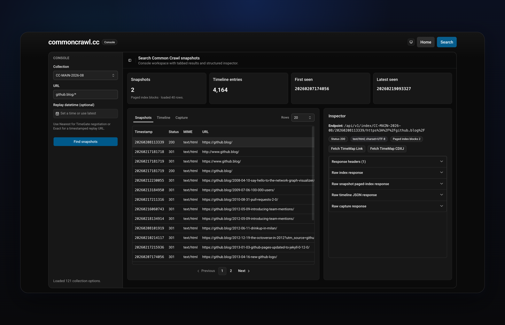

<h1 align="center">commoncrawl.cc</h1>

<p align="center">
  A search-focused web console and API proxy for exploring Common Crawl index data.
</p>

<p align="center">
  <a href="https://github.com/sudosubin/commoncrawl.cc/actions/workflows/ci.yml"></a>
  <a href="https://commoncrawl.cc"></a>
  <a href="https://api.commoncrawl.cc/openapi.json"></a>
  <a href="./LICENSE"></a>
  <a href="https://github.com/sponsors/sudosubin"></a>
</p>

commoncrawl.cc makes Common Crawl index data easier to explore from the browser.
It combines a fast web UI with a typed API proxy so you can inspect captures, timelines,
and raw responses without manually stitching together index endpoints.

<p align="center">
  <a href="https://commoncrawl.cc/search?url=github.blog%2F*">
    
  </a>
</p>

<p align="center">
  Example search workspace exploring <code>github.blog/*</code> snapshots, timeline metadata, and capture inspection.
</p>

## Why this project exists

Common Crawl is incredibly useful, but its index APIs are still fairly low-level for day-to-day exploration.
commoncrawl.cc aims to provide a cleaner workflow for developers, researchers, SEO teams, archivists,
and data engineers who need to:

- search snapshot history for a URL
- inspect capture timelines
- fetch raw capture responses
- experiment from a browser instead of ad-hoc scripts
- build against a typed OpenAPI surface

## Features

- Search-focused UI for Common Crawl index exploration
- Snapshot, timeline, and capture inspection workflows
- Raw response preview for capture debugging
- Cloudflare Worker API proxy for `index.commoncrawl.org`
- Generated OpenAPI spec and typed web client
- MSW-backed local mocking for frontend development
- Cloudflare-based deployment workflow for API and web

## Live endpoints

- Web: https://commoncrawl.cc
- API: https://api.commoncrawl.cc
- OpenAPI: https://api.commoncrawl.cc/openapi.json

## Sponsors

commoncrawl.cc is maintained as an independent open source project.
Sponsorship helps fund ongoing maintenance, UX improvements, API hardening, documentation,
and the time required to keep the project useful and free for the community.

If your company uses Common Crawl for search, SEO, archival, research, data enrichment,
or LLM pipelines, sponsoring this project is a practical way to support the tooling around that ecosystem.

<p align="center">
  <a href="https://github.com/sponsors/sudosubin">
    
  </a>
</p>

> No sponsors yet — your company can become the founding sponsor.

### Sponsor visibility

<table>
  <tr>
    <td align="center" width="33%">
      <a href="https://github.com/sponsors/sudosubin">
        
      </a>
      <br />
      Top README placement
    </td>
    <td align="center" width="33%">
      <a href="https://github.com/sponsors/sudosubin">
        
      </a>
      <br />
      Sponsor section placement
    </td>
    <td align="center" width="33%">
      <a href="https://github.com/sponsors/sudosubin">
        
      </a>
      <br />
      Acknowledgement and support
    </td>
  </tr>
</table>

A dedicated sponsor kit with tiers, logo guidelines, and company contact details can be added as the sponsorship program evolves.

## Packages

- [`packages/web`](./packages/web/README.md) — Preact + Vite frontend for search and capture exploration
- [`packages/api`](./packages/api/README.md) — Cloudflare Worker proxy and OpenAPI source

## Architecture

```text
Browser UI (packages/web)
  -> API proxy (packages/api)
    -> index.commoncrawl.org
```

The web app consumes generated API clients based on the Worker's exported OpenAPI spec.
That keeps the frontend and proxy contract aligned.

## Quick start

### 1) Install dependencies

```bash
pnpm install
```

### 2) Configure the web app

```bash
cp packages/web/.env.example packages/web/.env
```

### 3) Start the API

```bash
pnpm --filter @commoncrawl.cc/api dev
```

### 4) Start the web app

```bash
pnpm --filter @commoncrawl.cc/web dev
```

Then open:

- http://localhost:3000

The web app expects the API at `http://localhost:8787` by default.

## Development

### Build

```bash
pnpm --filter @commoncrawl.cc/api build
pnpm --filter @commoncrawl.cc/web build
```

### Test

```bash
pnpm --filter @commoncrawl.cc/web test
```

### Lint and format

```bash
pnpm lint
pnpm fmt:check
```

### Sync OpenAPI artifacts

```bash
pnpm openapi:sync
```

This exports the API OpenAPI spec and regenerates the typed web client.

## Tech stack

- Preact
- Vite
- preact-iso
- Hono
- Cloudflare Workers
- Cloudflare Pages
- Orval
- MSW
- pnpm workspace

## Contributing

Issues and pull requests are welcome.
If you find rough edges in the search workflow, timeline view, replay behavior,
or API contract, feedback is especially valuable.

## License

[MIT](./LICENSE)
